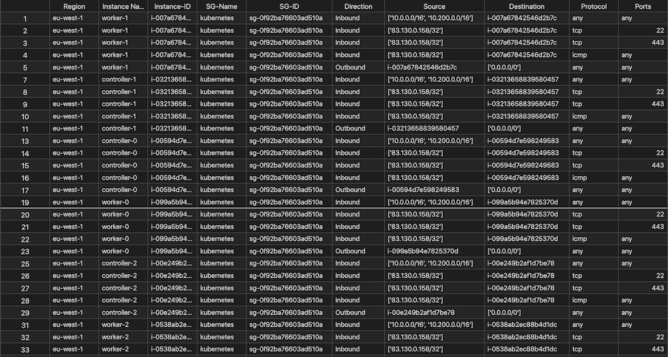

# Security Groups Report Generator

Security Group Report Generator provides you a centralized, point in time report of your security groups policy.  
The script outputs an excel table:




### Prerequisites

Configure AWS CLI credentials:
```
aws configure
```
or
```
export AWS_ACCESS_KEY_ID="ASXXXXXXX"
export AWS_SECRET_ACCESS_KEY="XXXXXXXXX"
export AWS_SESSION_TOKEN="XXXXXXXXX"
```
### Install
1. Clone this repo
2. ```pip install .```

### Getting Started


1. Run the tool ```security-groups-report```
2. Wait
3. Review the generated excel file
## Security
See [CONTRIBUTING](CONTRIBUTING.md#security-issue-notifications) for more information.

## License
This library is licensed under the Apache 2.0 License. See the LICENSE file.

